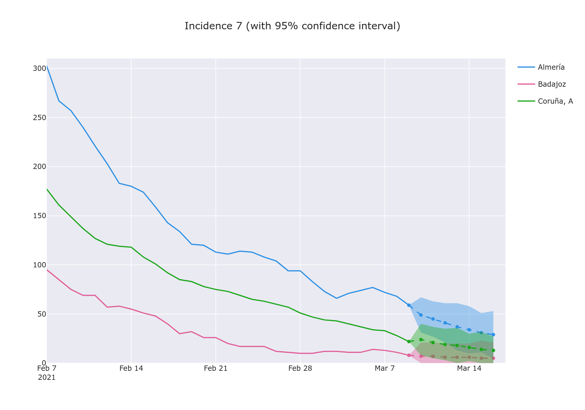

covid-dl
========

Machine Learning models for COVID-19 risk prediction

> **WARNING** Keep in mind this is a project still in development, and the predictions of the models are not always reliable. Use at your own discretion.

[comment]: <> (Additional information on how we train/tested the different models, as well as the performance results, can be found on the [model's report]&#40;reports/summary.md&#41;.)

We provide a simple Google Colab notebook so that you can have a quick glance at the results of the model without having to install anything. It will show different metrics of how well the different models we trained performed. Just run it and play with the Dash graphs:

[](https://colab.research.google.com/drive/1VTsF0zGno9Nkn23UHccmjytZkCseqlme?usp=sharing)


## Usage

### Requirements
Install the module's requirements:
```bash
pip install -r requirements.txt
```

### Data fetching

Copy the `provinces-incidence-mobility.csv` file (obtained from the [covid-risk-map](https://github.com/IFCA/covid-risk-map) repo) to the `data/raw` folder.

Alternatively, you can download the [original dataset](http://api.cloud.ifca.es:8080/swift/v1/covid/provinces-incidence-mobility.csv) we used to perform the analysis:
```bash
wget -O covid-dl/data/raw/provinces-incidence-mobility.csv https://api.cloud.ifca.es:8080/swift/v1/covid/provinces-incidence-mobility.csv
```

### Training a model
If you want to train a model on your data run:
```bash
python train.py
```
If you already have a trained model (in `models/feedforward`) you can go directly to the prediction step. 

### Predicting future incidence
To make a prediction into the future from the last available date run:
```bash
python predict.py
```
This will write a `predictions.csv` file in `data/predictions`.

To view the results interactively, run a plotly instance with:
```bash
python visualize.py
```


